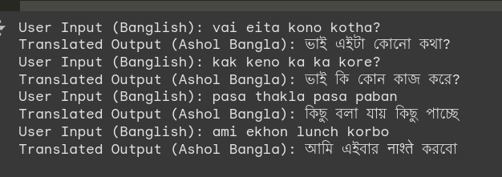

# BitfestTeamExpelledSolutions

## Challenge 1

Here we have trained an `mBART` model, specifically `mbart-large-50` model, which is a very good choice for working under low hardware resources and has 50 language support out of the box.

We have finetuned this model to enable it for `banglish` to `pure bangla` text generation. For that we have used `https://huggingface.co/datasets/SKNahin/bengali-transliteration-data` dataset.

To train the model we have used `PyTorch`. And for loading datasets and models we have used huggingface `datasets` and `transformers` libraries respectively.

The model can be found in huggingface: https://huggingface.co/mhabrar/BitfestTeamExpelledSolutionMode.

The model was trained for 10 minutes with 1000 steps on a T4 GPU on Google Colab with a learning rate of 2e-5. Since we didn't get enough time to train the model, it's accurary is pretty poor actually :(

After training, the loss was `0.85`, which is pretty high! (Again not enough time, not enough epochs! 2-3 epochs would have pulled out better results.)

Here you can see the User Input and User Output Demo:



Here are the training parameters used to train this model:

```
training_args = Seq2SeqTrainingArguments(
    output_dir="./results",
    eval_strategy="epoch",
    learning_rate=2e-5,
    per_device_train_batch_size=1,
    per_device_eval_batch_size=1,
    weight_decay=0.01,
    save_total_limit=2,
    max_steps=1000,
    predict_with_generate=True,
    fp16=torch.cuda.is_available(),
    logging_dir="./logs",
    logging_steps=100,
    save_strategy="epoch",
    report_to="none",
)
```

## Challenge 2

This project is an Express.js API that provides endpoints for managing favorite recipes and ingredients. The API includes routes for adding, updating, and retrieving recipes and ingredients, as well as interacting with a chatbot.

### Getting Started

#### Prerequisites

-   Node.js
-   npm
-   PostgreSQL

#### Installation

1. Clone the repository
2. Navigate to the `challange2` directory
3. Set up **PostgreSQL** as the database.
4. Install the dependencies

```sh
npm install
```

5. Create a `.env` file in the `challange2` directory with the following content:

```
GROQ_API_KEY=your_groq_api_key
```

#### Running the Server

To start the server in development mode:

```sh
npm run dev
```

To start the server in production mode:

```sh
npm start
```

The server will start at `http://localhost:3000`.

### API Endpoints

#### Recipes

##### Add a New Favorite Recipe

-   **URL:** `/api/v1/recipes/add`
-   **Method:** `POST`
-   **Request Body:**
    ```json
    {
        "recipeText": "Your recipe text here"
    }
    ```
-   **Response:**
    ```json
    {
        "message": "Recipe added successfully."
    }
    ```

##### Retrieve All Favorite Recipes

-   **URL:** `/api/v1/recipes`
-   **Method:** `GET`
-   **Response:**
    ```json
    {
        "favoriteRecipes": [{ "id": 1, "recipe_text": "Your recipe text here" }]
    }
    ```

##### Suggest a Recipe

-   **URL:** `/api/v1/recipes/suggest`
-   **Method:** `GET`
-   **Response:**
    ```json
    {
        "response": "Suggested recipe based on available ingredients."
    }
    ```

#### Ingredients

##### Add New Ingredients

-   **URL:** `/api/v1/ingredients/add`
-   **Method:** `POST`
-   **Request Body:**
    ```json
    {
        "items": [
            { "name": "ingredient1", "quantity": 1 },
            { "name": "ingredient2", "quantity": 2 }
        ]
    }
    ```
-   **Response:**
    ```json
    {
        "message": "Ingredients added successfully."
    }
    ```

##### Update Ingredients

-   **URL:** `/api/v1/ingredients/update`
-   **Method:** `PUT`
-   **Request Body:**
    ```json
    {
        "name": "ingredient1",
        "quantity": 3
    }
    ```
-   **Response:**
    ```json
    {
        "message": "Ingredient updated successfully.",
        "ingredient": { "name": "ingredient1", "quantity": 3 }
    }
    ```

##### Cook an Ingredient (Decrease Quantity)

-   **URL:** `/api/v1/ingredients/cook`
-   **Method:** `PUT`
-   **Request Body:**
    ```json
    {
        "name": "ingredient1",
        "quantity": 1
    }
    ```
-   **Response:**
    ```json
    {
        "message": "Ingredient cooked successfully.",
        "ingredient": { "name": "ingredient1", "quantity": 0 }
    }
    ```

##### Get All Available Ingredients

-   **URL:** `/api/v1/ingredients`
-   **Method:** `GET`
-   **Response:**
    ```json
    {
        "ingredients": [
            { "name": "ingredient1", "quantity": 1 },
            { "name": "ingredient2", "quantity": 2 }
        ]
    }
    ```

#### Chatbot

##### Interact with the Chatbot

-   **URL:** `/api/v1/chat`
-   **Method:** `GET`
-   **Query Parameters:**
    -   `message`: The message to send to the chatbot
-   **Response:**
    ```json
    {
        "response": "Chatbot response here"
    }
    ```

### Middleware

The API uses the following middleware:

-   `express.json()` and `express.urlencoded()` for parsing JSON and URL-encoded request bodies
-   `morgan` for logging HTTP requests
-   `helmet` for securing HTTP headers
-   `express-rate-limit` for rate limiting
